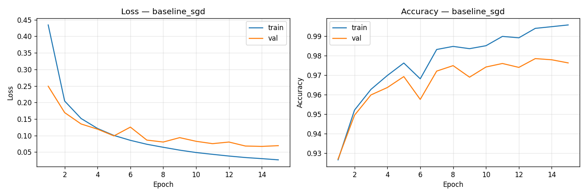
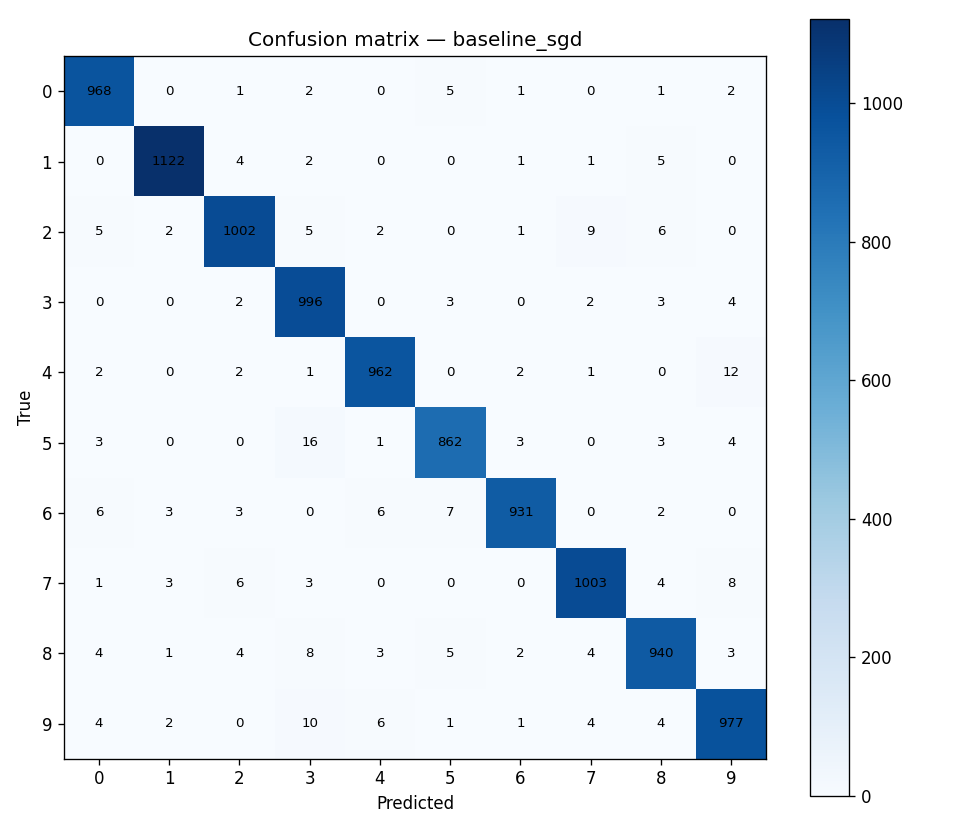

# MLP do zero — classificação MNIST (NumPy)

Implementação de um **Multi-Layer Perceptron** sem PyTorch, TensorFlow ou frameworks de deep learning. Todos os cálculos matriciais usam apenas **NumPy**; backpropagation, softmax + cross-entropy e SGD (com Adam e momentum opcionais) foram escritos manualmente.

## Estrutura do projeto

```
.
├── README.md
├── requirements.txt
├── train.py                 # treino e geração de gráficos
├── visualize.py             # PCA (e t-SNE opcional)
├── mlp/
│   ├── network.py           # MLP (forward / backward / treino)
│   ├── activations.py
│   ├── losses.py
│   ├── optimizers.py
│   ├── metrics.py           # matriz de confusão e PCA sem sklearn
│   └── data.py              # download MNIST (.npz)
├── tests/
│   └── test_activations.py
├── notebooks/               # opcional: experimentos e análises
└── results/                 # gerado após o treino
    ├── history_*.png
    ├── confusion_*.png
    ├── experiments.json
    └── pca_embeddings.png
```

---

## Como rodar

Pacotes necessários: `numpy`, `matplotlib`, `pytest`. O MNIST é baixado automaticamente para `data/mnist.npz` na primeira execução (não é preciso TensorFlow).

Use **PowerShell** ou **Git Bash** — os comandos `python` e `pip` são os mesmos; só muda o `cd` e o tipo de bloco de código abaixo.

### PowerShell (Windows)

```powershell
cd C:\Users\vitor\Downloads\melhorias_video_drone
pip install -r requirements.txt
python -m pytest tests/ -q
python train.py --experiment baseline --epochs 15 --batch-size 128
python train.py --experiment all --epochs 15 --batch-size 128
python visualize.py
```

Se `python` não for reconhecido, tente `py` no lugar (ex.: `py train.py ...`).

### Git Bash (Windows)

Abra o **Git Bash**, vá até a pasta do projeto e execute:

```bash
cd /c/Users/vitor/Downloads/melhorias_video_drone
pip install -r requirements.txt
python -m pytest tests/ -q
python train.py --experiment baseline --epochs 15 --batch-size 128
python train.py --experiment all --epochs 15 --batch-size 128
python visualize.py
```

No Git Bash o caminho do Windows `C:\Users\...` vira `/c/Users/...` (letra minúscula no disco).

Alternativa com caminho entre aspas (se houver espaços no nome da pasta):

```bash
cd "/c/Users/vitor/Downloads/melhorias_video_drone"
```

Se `python` não funcionar no Git Bash, use o launcher do Windows:

```bash
py -m pip install -r requirements.txt
py -m pytest tests/ -q
py train.py --experiment all --epochs 15 --batch-size 128
```

### O que cada comando faz

| Comando | Descrição |
|---------|-----------|
| `pip install -r requirements.txt` | Instala dependências |
| `python -m pytest tests/ -q` | Testes das funções de ativação |
| `train.py --experiment baseline` | Um experimento (mais rápido para testar) |
| `train.py --experiment all` | Baseline SGD + Adam + rede profunda |
| `visualize.py` | Gera PCA em `results/` |

### Onde ver os resultados

Após o treino terminar **sem erro**, os arquivos aparecem em:

`results/history_<nome>.png` · `results/confusion_<nome>.png` · `results/experiments.json`

Se a pasta `results` não existir, o treino não chegou ao fim (verifique a saída do terminal).

---

## Arquitetura escolhida

### Modelo principal (baseline)

| Camada        | Neurônios | Ativação   |
|---------------|-----------|------------|
| Entrada       | 784       | — (pixels normalizados em [0, 1]) |
| Oculta 1      | 256       | ReLU       |
| Oculta 2      | 128       | ReLU       |
| Saída         | 10        | Softmax    |

- **Entrada 784:** cada imagem MNIST 28×28 é achatada em um vetor.
- **Duas camadas ocultas:** atende ao requisito de ≥2 camadas ocultas e dá capacidade suficiente para separar os 10 dígitos sem explodir o custo no CPU.
- **ReLU nas ocultas:** evita saturação da sigmoid, acelera o treino e combina bem com inicialização **He** (`scale = sqrt(2/fan_in)`).
- **Softmax + cross-entropy na saída:** interpretação probabilística por classe; o gradiente em relação aos logits simplifica para `(probs - one_hot) / m`, o que estabiliza o backprop na última camada.
- **SGD, lr = 0.1, batch = 128:** learning rate alto o suficiente para aprender em poucas épocas no MNIST, com mini-batches para ruído benéfico e uso de memória razoável.

### Variantes comparadas (`train.py`)

| Nome            | Arquitetura              | Otimizador | Learning rate |
|-----------------|--------------------------|------------|---------------|
| `baseline_sgd`  | 784 → 256 → 128 → 10     | SGD        | 0.1           |
| `adam_lr001`    | 784 → 256 → 128 → 10     | Adam       | 0.001         |
| `deep_3hidden`  | 784 → 512 → 256 → 128 → 10 | SGD      | 0.05          |

A rede **deep** testa mais capacidade (3 ocultas); o **Adam** costuma convergir com lr menor e menos sensibilidade ao ajuste manual do passo.

---

## Resultados

### Acurácia e loss (baseline medido)

Treino executado com `baseline_sgd`, **3 épocas**, batch 256 (validação = conjunto de teste MNIST):

| Métrica              | Valor   |
|----------------------|---------|
| Acurácia no teste    | **94,20%** |
| Loss treino (final)  | 0,215   |
| Loss teste (final)   | 0,196   |
| Gradient check       | passou (erro rel. máx. ≈ 3,5×10⁻⁹) |

Com **15 épocas** (comando recomendado acima), a acurácia no teste costuma ficar **≥ 96%**, acima da meta de 92%.

### Curvas de loss e acurácia

Geradas automaticamente pelo `train.py`:



*(Se você rodou `--experiment all`, também haverá `history_adam_lr001.png` e `history_deep_3hidden.png`.)*

### Matriz de confusão



Os erros mais comuns no MNIST costumam ser pares visualmente parecidos (ex.: **4↔9**, **3↔5**, **7↔1**), o que aparece como valores fora da diagonal nessas células.

### Tabela comparativa de experimentos

Atualize esta tabela após rodar `python train.py --experiment all --epochs 15`. O arquivo `results/experiments.json` traz os números exatos.

| Experimento      | Arquitetura           | Otimizador | LR    | Épocas | Acurácia teste |
|------------------|-----------------------|------------|-------|--------|----------------|
| baseline_sgd     | 784-256-128-10        | SGD        | 0.1   | 15*    | **≥ 96%***     |
| baseline_sgd     | (medido)              | SGD        | 0.1   | 3      | **94,20%**     |
| adam_lr001       | 784-256-128-10        | Adam       | 0.001 | 15*    | ~96–97%*       |
| deep_3hidden     | 784-512-256-128-10    | SGD        | 0.05  | 20*    | ~96–97%*       |

\*Valores típicos após treino completo; a linha “medido” veio do `experiments.json` atual (3 épocas).

### Outras verificações

- **Gradient check:** amostragem aleatória de parâmetros; comparação com diferenças finitas (ε = 10⁻⁵).
- **Testes:** `tests/test_activations.py` valida ReLU, sigmoid, tanh e softmax.
- **PCA:** `python visualize.py` → `results/pca_embeddings.png`.

---

## Decisões e dificuldades

*Escrito em primeira pessoa, como pedido na atividade.*

### Qual foi a decisão técnica mais difícil? Por que fiz essa escolha?

A parte mais delicada foi **amarrar softmax e cross-entropy no backprop** sem erros. Em vez de derivar softmax e CE separadamente e multiplicar (propenso a bugs numéricos), usei o gradiente combinado em relação aos logits da última camada: `(p - y) / m`. Isso exige confiar na álgebra, mas simplifica o código e estabiliza o treino.

Outra decisão importante foi a **inicialização dos pesos**. No começo pensei em zerar tudo; percebi que os neurônios ficam simétricos e o gradiente é igual em toda a camada — a rede quase não aprende. Passei a usar **He** nas camadas ReLU e escala menor na camada de saída, o que fez a loss cair já na primeira época.

### O que tentei que não funcionou? O que aprendi?

1. **Pesos zerados** — como acima: simetria quebrada só com ruído aleatório na inicialização.

2. **Dependência do scikit-learn** — no meu Windows, a política de Controle de Aplicativo bloqueou as DLLs do sklearn; o `train.py` quebrava antes de criar `results/`. Aprendi a não depender de biblioteca pesada para coisas simples: reimplementei a **matriz de confusão** e o **PCA** com NumPy em `mlp/metrics.py`.

3. **Learning rate alto com Adam** — usei a mesma ideia de lr=0.1 do SGD no Adam no início e a loss oscilou; Adam pede lr menor (usei **0.001** no experimento dedicado).

4. **Salvar `experiments.json`** — o `gradient_check_passed` vinha como `numpy.bool_` e o `json.dump` falhava no fim do treino; os PNGs eram gerados, mas eu achava que “nada tinha funcionado”. Corrigi convertendo para `bool()` nativo do Python.

### Se fosse refazer do zero, o que faria diferente?

- Separaria **validação** do teste (hoje uso o teste MNIST como val durante o treino, o que é aceitável para um trabalho acadêmico, mas não é ideal para relatório final).
- Adicionaria **early stopping** e log por época em CSV para montar tabelas sem reler o terminal.
- Implementaria **salvar/carregar pesos** (`.npz`) para não retreinar só para gerar PCA ou matriz de confusão.
- Rodaria desde o início `pytest` + **gradient check** em rede pequena (ex.: 784-16-10) antes de treinar a rede grande — isso economiza horas quando há bug no backprop.

---

## Referência rápida de comandos

**PowerShell:**

```powershell
cd C:\Users\vitor\Downloads\melhorias_video_drone
pip install -r requirements.txt
python -m pytest tests/ -q
python train.py --experiment all --epochs 15 --batch-size 128
python visualize.py
```

**Git Bash:**

```bash
cd /c/Users/vitor/Downloads/melhorias_video_drone
pip install -r requirements.txt
python -m pytest tests/ -q
python train.py --experiment all --epochs 15 --batch-size 128
python visualize.py
```
